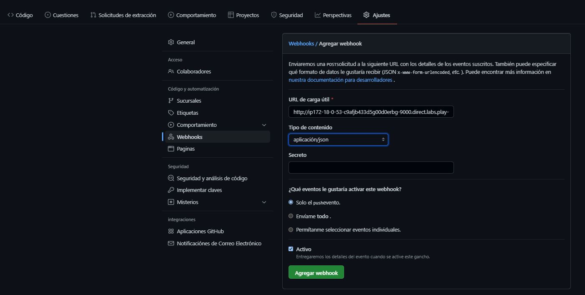
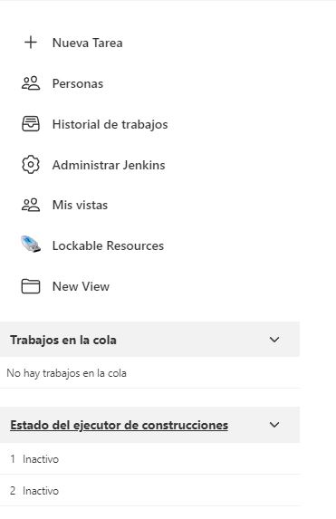
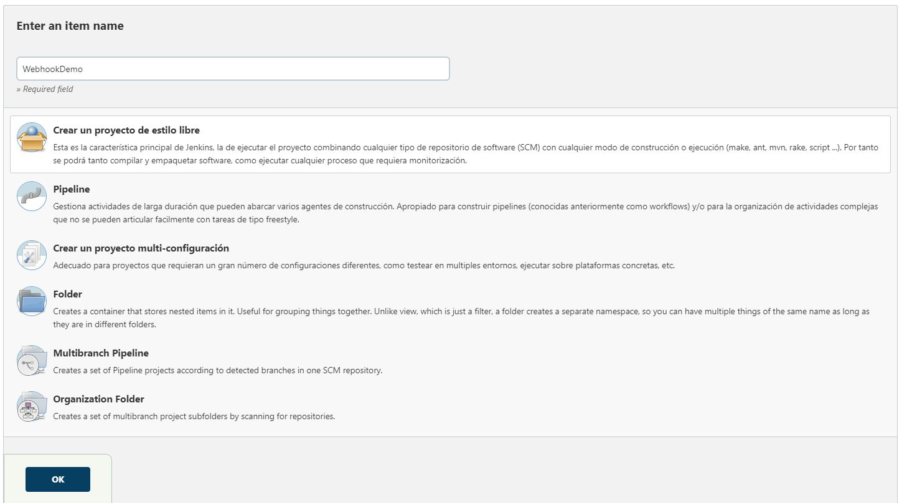
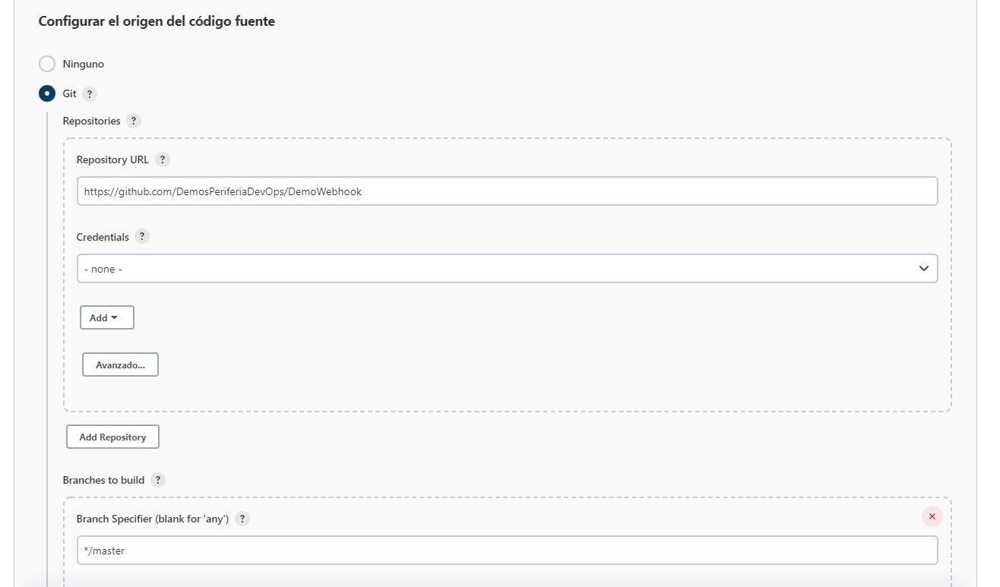
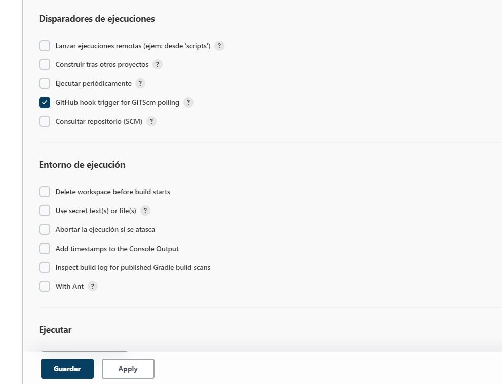
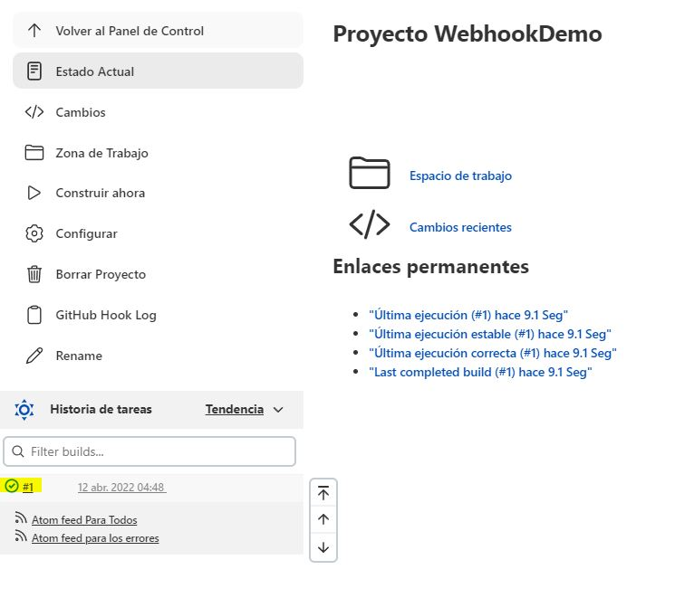

# Configuración del webhook 

### Configuración desde el proyecto de github
* *Ir a configuracion > Webhooks > Agregar webhook > Complementar campos requeridos (url del servidor de jenkins)* 

### Configuración desde Jenkins
* *Ir a nueva tarea*

* *Ingresar nombre > Crear un proyecto de estilo libre > OK*

* *En configuracion seleccionamos Git > incluimos el repositorio > deifiinimos la rama en la cual se va a trabajar*

* *Activamos el disparador de ejecucion GitHub hook Trigger y le damos en guardar*

* *Al realizar un push en la rama master de nuestro repositorio se notifican los cambios en Jenkins, lo cual indica que el Webhook ha sido configurado satisfactoriamente*

